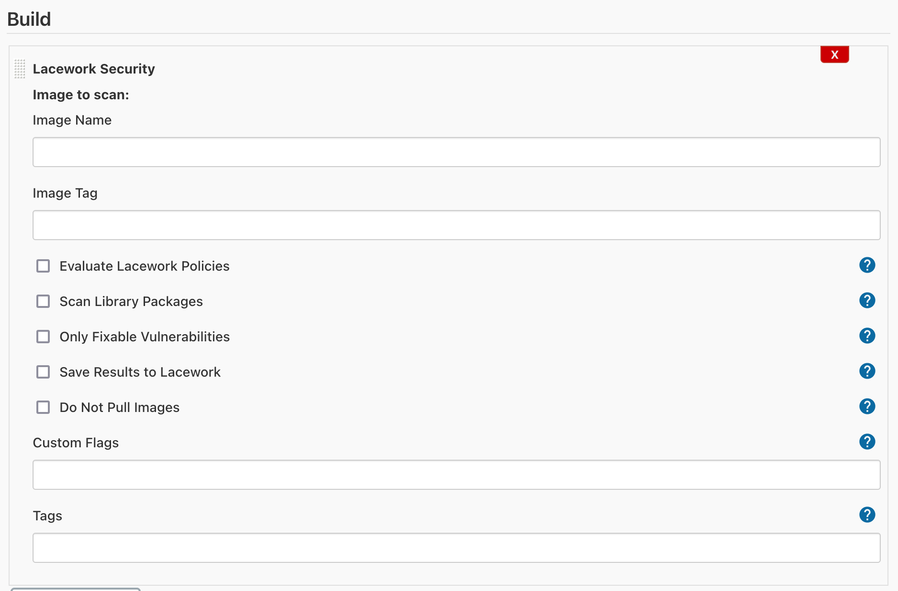

# Lacework Security

## Introduction

This Jenkins plugin enables easy integration with the Lacework security platform to perform container assurance assessments.

## Getting started

### 1. Create an Inline Scanner integration

To configure this plugin, you will need to generate an Inline Scanner integration within your Lacework account. To create the Inline Scanner integration, follow the documentation <a target="_blank" href="https://docs.lacework.com/integrate-inline-scanner">here</a>.

### 2. Configure the Lacework Jenkins plugin

#### Global configuration

Once the Inline Scanner integration is created in your Lacework account, you will need to provide your Lacework account name and Inline Scanner access token in order to configure the Jenkins plugin. To configure, navigate to "Manage Jenkins" -> "Configure System", then scroll to the "Lacework Security" section. Input the Lacework account name and Inline Scanner access token into the appropriate fields, then click Save.

<blockquote>

📷 Show Preview

</blockquote>

#### Build Step Configuration

Once the global configuration is complete, you can add the Lacework Security build step to your pipelines. This will allow container assurance and vulnerability assessments to take place during the build process, and fail builds (if desired) that do not abide by specified policies.

Provide the container image name and tag (environment variables are allowed) and select the appropriate options for the container assessment. Custom command-line aguments can be provided, and custom tags can be provided in JSON key/value format.

<blockquote>

📷 Show Preview

</blockquote>

Once the Lacework Scan build step is added, it will produce a vulnerability report as an artifact for the build

## Contributing

To contribute to this repository, please review the [CONTRIBUTING](CONTRIBUTING.md) file.

Also, please refer to the Jenkins [contribution guidelines](https://github.com/jenkinsci/.github/blob/master/CONTRIBUTING.md)

## LICENSE

Licensed under MIT, see [LICENSE](LICENSE.md)
